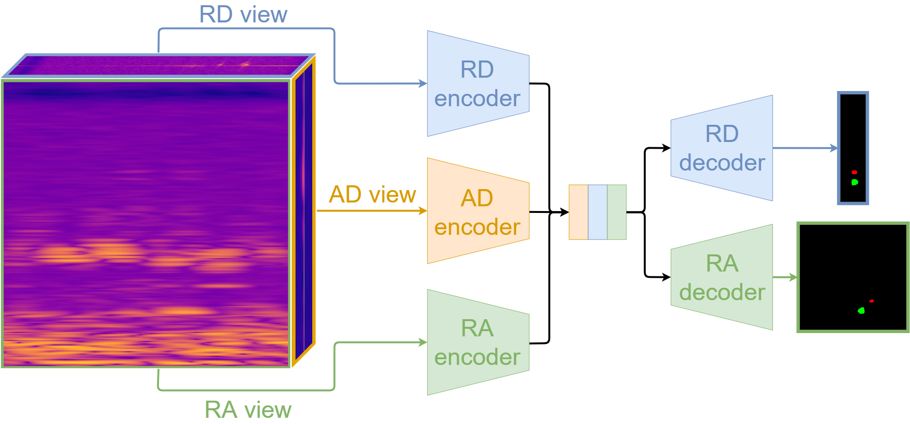

# Multi-View Radar Semantic Segmentation

## Paper



[Multi-View Radar Semantic Segmentation](https://arxiv.org/abs/2103.16214), Preprint under review, ArXiv 2021.

[Arthur Ouaknine](https://arthurouaknine.github.io/), [Alasdair Newson](https://sites.google.com/site/alasdairnewson/), [Patrick Pérez](https://ptrckprz.github.io/), [Florence Tupin](https://perso.telecom-paristech.fr/tupin/), [Julien Rebut](https://scholar.google.com/citations?user=BJcQNcoAAAAJ&hl=fr)

This repository groups the implemetations of the MV-Net and TMVA-Net architectures proposed in [the paper of Ouaknine *et al.*](https://arxiv.org/abs/2103.16214).

The models are trained and tested on the [CARRADA dataset](https://arxiv.org/abs/2005.01456).

The CARRADA dataset is available on Arthur Ouaknine's personal web page at this link: [https://arthurouaknine.github.io/codeanddata/carrada](https://arthurouaknine.github.io/codeanddata/carrada).

If you find this code useful for your research, please cite [our paper](https://arxiv.org/abs/2103.16214):
```
@misc{ouaknine2021multiview,
      title={Multi-View Radar Semantic Segmentation},
      author={Arthur Ouaknine and Alasdair Newson and Patrick Pérez and Florence Tupin and Julien Rebut},
      year={2021},
      eprint={2103.16214},
      archivePrefix={arXiv},
      primaryClass={cs.CV}
}
```


## Installation with Docker

It is strongly recommanded to use Docker with the provided [Dockerfile](./Dockerfile) containing all the dependencies.

0. Clone the repo:
```bash
$ git clone https://github.com/ArthurOuaknine/MVRSS.git
```

1. Create the Docker image:
```bash
$ cd MVRSS/
$ docker build . -t "mvrss:Dockerfile"
```

**Note**: The CARRADA dataset used for train and test is considered as already downloaded by default. If it is not the case, you can uncomment the corresponding command lines in the [Dockerfile](./Dockerfile) or follow the guidelines of the dedicated [repository](https://github.com/valeoai/carrada_dataset).

2. Run a container and join an interactive session. Note that the option `-v /host_path:/local_path` is used to mount a volume (corresponding to a shared memory space) between the host machine and the Docker container and to avoid copying data (logs and datasets). You will be able to run the code on this session:
```bash
$ docker run -d --ipc=host -it -v /host_machine_path/datasets:/home/datasets_local -v /host_machine_path/logs:/home/logs --name mvrss --gpus all mvrss:Dockerfile sleep infinity
$ docker exec -it mvrss bash
```


## Installation without Docker

You can either use Docker with the provided [Dockerfile](./Dockerfile) containing all the dependencies, or follow these steps.

0. Clone the repo:
```bash
$ git clone https://github.com/ArthurOuaknine/MVRSS.git
```

1. Install this repository using pip:
```bash
$ cd MVRSS/
$ pip install -e .
```
With this, you can edit the MVRSS code on the fly and import function and classes of MVRSS in other project as well.

2. Install all the dependencies using pip and conda, please take a look at the [Dockerfile](./Dockerfile) for the list and versions of the dependencies.

3. Optional. To uninstall this package, run:
```bash
$ pip uninstall MVRSS
```

You can take a look at the [Dockerfile](./Dockerfile) if you are uncertain about steps to install this project.


## Running the code

In any case, it is **mandatory** to specify beforehand both the path where the CARRADA dataset is located and the path to store the logs and models. Example: I put the Carrada folder in /home/datasets_local, the path I should specify is /home/datasets_local. The same way if I store my logs in /home/logs. Please run the following command lines while adapting the paths to your settings:

```bash
$ cd MVRSS/mvrss/utils/
$ python set_paths.py --carrada /home/datasets_local --logs /home/logs
```

### Training

In order to train a model, a JSON configuration file should be set. The configuration file corresponding to the selected parameters to train the TMVA-Net architecture is provided here: `MVRSS/mvrss/config_files/tmvanet.json`. To train the TMVA-Net architecture, please run the following command lines:

```bash
$ cd MVRSS/mvrss/
$ python train.py --cfg config_files/tmvanet.json
```

If you want to train the MV-Net architecture (baseline), please use the corresponding configuration file: `mvnet.json`.

### Testing

To test a recorded model, you should specify the path to the configuration file recorded in your log folder during training. Per example, if you want to test a model and your log path has been set to `/home/logs`, you should specify the following path: `/home/logs/carrada/tmvanet/name_of_the_model/config.json`. This way, you should execute the following command lines:

```bash
$ cd MVRSS/mvrss/
$ python test.py --cfg /home/logs/carrada/tmvanet/name_of_the_model/config.json
```
Note: the current implementation of this script will generate qualitative results in your log folder. You can disable this behavior by setting `get_quali=False` in the parameters of the `predict()` method of the `Tester()` class.


## Acknowledgements
- The paper is under review, special thanks will be indicated after the final results
- The Soft Dice loss is based on the code from <https://github.com/kornia/kornia/blob/master/kornia/losses/dice.py>

## License

The MVRSS repo is released under the Apache 2.0 license.
